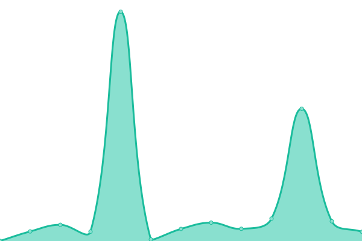

# [📈 Live Status](https://mailpace.github.io/status): <!--live status--> **🟩 All systems operational**

This repository contains the open-source uptime monitor and status page for [MailPace.com](https://mailpace.com), powered by [Upptime](https://github.com/upptime/upptime).

With [Upptime](https://upptime.js.org), you can get your own unlimited and free uptime monitor and status page, powered entirely by a GitHub repository. We use [Issues](https://github.com/mailpace/status/issues) as incident reports, [Actions](https://github.com/mailpace/status/actions) as uptime monitors, and [Pages](https://mailpace.github.io/status) for the status page.

<!--start: status pages-->
<!-- This summary is generated by Upptime (https://github.com/upptime/upptime) -->
<!-- Do not edit this manually, your changes will be overwritten -->
<!-- prettier-ignore -->
| URL | Status | History | Response Time | Uptime |
| --- | ------ | ------- | ------------- | ------ |
|  [Application](https://app.mailpace.com) | 🟩 Up | [application.yml](https://github.com/mailpace/status/commits/HEAD/history/application.yml) | 

 510ms
     
 | 

<a href="https://status.mailpace.com/history/application">100.00%</a>
    

|  [Documentation](https://docs.mailpace.com) | 🟩 Up | [documentation.yml](https://github.com/mailpace/status/commits/HEAD/history/documentation.yml) | 

 298ms
     
 | 

<a href="https://status.mailpace.com/history/documentation">100.00%</a>
    

|  [Blog](https://blog.mailpace.com) | 🟩 Up | [blog.yml](https://github.com/mailpace/status/commits/HEAD/history/blog.yml) | 

 151ms
     
 | 

<a href="https://status.mailpace.com/history/blog">100.00%</a>
    

|  [Landing Page](https://mailpace.com) | 🟩 Up | [landing-page.yml](https://github.com/mailpace/status/commits/HEAD/history/landing-page.yml) | 

 84ms
     
 | 

<a href="https://status.mailpace.com/history/landing-page">100.00%</a>
    

|  [SMTP Server](smtp.mailpace.com) | 🟩 Up | [smtp-server.yml](https://github.com/mailpace/status/commits/HEAD/history/smtp-server.yml) | 

 129ms
     
 | 

<a href="https://status.mailpace.com/history/smtp-server">100.00%</a>
    

<!--end: status pages-->

[**Visit our status website →**](https://mailpace.github.io/status)

## 📄 License

- Powered by: [Upptime](https://github.com/upptime/upptime)
- Code: [MIT](./LICENSE) © [MailPace.com](https://mailpace.com)
- Data in the `./history` directory: [Open Database License](https://opendatacommons.org/licenses/odbl/1-0/)
